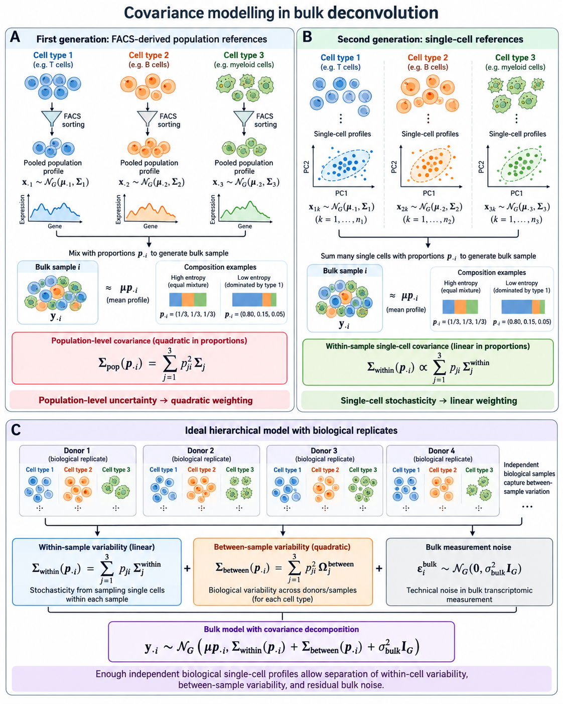
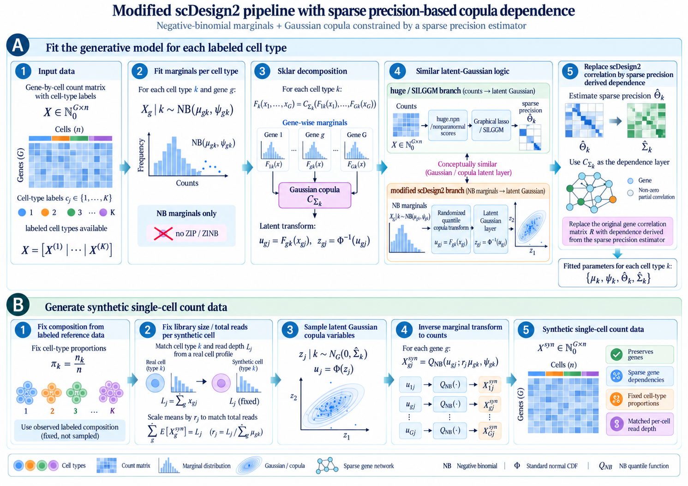
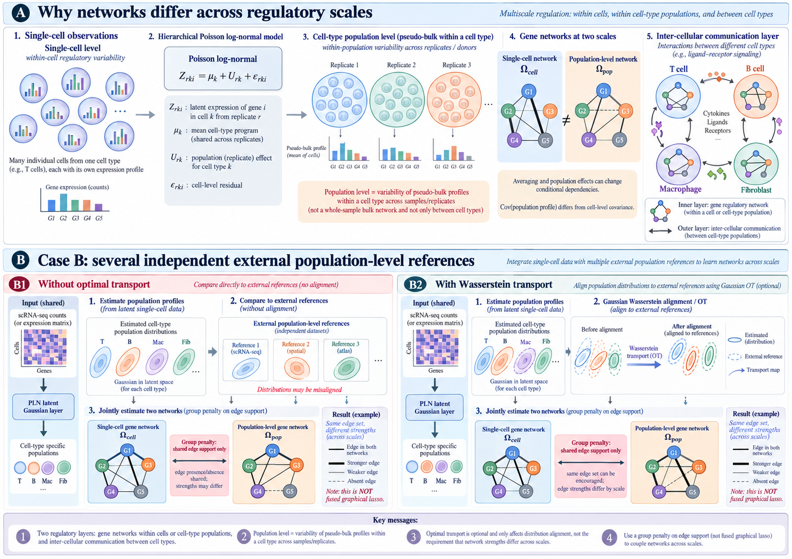

DeCovarT does not ingest single-cell profiles. It needs, for each labelled
type $j$, a population-level Gaussian
$(\boldsymbol{\mu}_{\cdot j},\boldsymbol{\Sigma}_{j})$ whose precision is sparse.
This chapter is about **lifting** cell-level observations to that object,
and about **checking** that the lift still represents the cells.

## Alignment of type-level Gaussians {#sec-align}

Two strategies are in the core. Optimal transport and mechanistic
simulators are perspectives (@sec-align-ot).

1.  **Affine invariance.** Closed-form means and covariances when cells
    of one type are independent Gaussians.
2.  **Resampling.** A technical bootstrap of cells, and Monte Carlo
    from `scDesign2`, with negative-binomial margins and a Gaussian
    copula tied to the sparse precision (@sec-align-mc).

```{mermaid}
%%| echo: false
%%| label: fig-align-layout
%%| fig-cap: "Core lifts from labelled cells of one type to a population Gaussian: an affine aggregation, and resampling (bootstrap or scDesign2). The bulk profile is a later convolution across types."
%%{init: {"theme": "sandstone"}}%%
flowchart TD
  A["Cells of type j"] --> B["Affine lift"]
  A --> D["Bootstrap or scDesign2"]
  B --> E["mu_j, Sigma_j"]
  D --> E
  E --> F["DeCovarT convolution across types"]
```

::: {#nte-not-y .callout-warning}
## :warning: A within-type sum is not the bulk convolution

Write $\boldsymbol{x}_{c\cdot j}$ for cell $c$ of type $j$. The object of
this chapter is a sum **inside** one type,

$$
\widetilde{\boldsymbol{x}}_{\cdot j}
=
\sum_{c\in C_{j}} w_{c}\,\boldsymbol{x}_{c\cdot j},
$$ {#eq-type-sum}

with $\sum_{c}w_{c}=1$ or $w_{c}\equiv 1$. Independent cells add means
and add covariances with weights $w_{c}^{2}$. That sum estimates
$\boldsymbol{\mu}_{\cdot j}$ and $\boldsymbol{\Sigma}_{j}$.

The DeCovarT observation is a convolution **across** types,

$$
\boldsymbol{y}
=
\sum_{j=1}^{J} p_{j}\,\boldsymbol{x}_{\cdot j}^{\mathrm{pop}},
\qquad
\mathrm{Cov}(\boldsymbol{y})
=
\sum_{j}p_{j}^{2}\boldsymbol{\Sigma}_{j}.
$$ {#eq-total-bulk}

The factor $p_{j}^{2}$ belongs to that convolution. This chapter
compares $\{\boldsymbol{x}_{c\cdot j}\}_{c\in C_{j}}$ with
$\mathcal{N}(\boldsymbol{\mu}_{\cdot j},\boldsymbol{\Sigma}_{j})$.
:::

## Which covariance to export {#sec-align-which-model}

DeCovarT today is a Gaussian convolution of one population profile per
type. The covariance weight is quadratic in the cell fraction. That
object is a **between-replicate** phenotype, not the scatter of cells
inside one donor. The three layers are drawn in
@fig-three-variability. `MuSiC`'s library-size assumptions, including
the extra A3$'$ hypothesis needed for absolute cell fractions, are in
@fig-music-assumptions.

{#fig-three-variability fig-alt="Schematic of three covariance layers: linear within-cell variability, quadratic between-sample variability, and diagonal bulk measurement noise."}

{#fig-music-assumptions fig-alt="MuSiC model assumptions A1 same population, A2 conserved cell-size ratios, A3 conserved library-size ratios, and A3-prime for absolute cell-type proportions."}

Before droplet scRNA-seq, the reference was a FACS- or MACS-purified
bulk library. Szaniszlo et al. showed that mixture expression reflects
composition, that a minor subset is recovered only after physical
sorting, and that coexpression among genes inside a purified type is
already a population-level object [@szaniszloGettingRightCells].
Novershtern et al. profiled 38 marker-defined haematopoietic
populations and used coexpression modules plus promoter *cis*-circuits
as the gene–gene structure of each state
[@novershternDenselyInterconnectedTranscriptional2011]. Those FACS
profiles still match DeCovarT's quadratic convolution.

Cells from one donor share genetic and environmental background, so they
are subsamples rather than independent biological units
[@zimmermanPracticalSolutionPseudoreplication2021]. Zimmerman, Espeland
and Langefeld document that dependence across cell types, contrast
within-donor cell variation with between-donor biological variation, and
treat donor as the random effect when comparing conditions. That
within-versus-between split is the same hierarchy as
$\boldsymbol{\Sigma}_{W,j}$ versus $\boldsymbol{\Sigma}_{B,j}$ when a
single-cell reference is aligned with bulk. Technical library-size and
platform scale sit in a third, residual layer
(@fig-music-assumptions). `Squair` et al. make the same point for
false discoveries if cells are treated as biological replicates
[@squairConfrontingFalseDiscoveries2021].

The package outlook
[DeCovarT perspectives](https://bastienchassagnol.github.io/DeCovarT/articles/theory-decovart-statistical-perspectives.html#sec-sc-moments)
derives the moments. The practical fork on this gastruloid is the
reference design.

### One biological replicate

Identify the per-cell mean by the arithmetic mean of raw counts, and
the within-cell covariance $\boldsymbol{\Sigma}_{W,j}$. Do not identify a
between-replicate covariance: one donor is one draw of the replicate
effect, and more cells only shrink the average of the cell noise.

Use a linear mixture covariance

$$
\kappa_i\sum_j p_{ji}\,\boldsymbol{\Sigma}_{W,j}
+
\boldsymbol{\Sigma}_{\mathrm{obs},i},
$$ {#eq-align-linear}

with $\kappa_i$ an effective inverse cell count for the bulk, and
$\boldsymbol{\Sigma}_{\mathrm{obs},i}$ diagonal. Keep a quadratic term only
for the Monte Carlo error of the reference mean,
$\boldsymbol{\Sigma}_{W,j}/C_{j1}$, and label it as such.

Report RNA fractions unless the transcriptome sizes $S_j$ are
measured. If they are measured, insert them in the mean. Do not
estimate them jointly with $\boldsymbol{p}$, and do not estimate a
gene-wise platform vector on the same bulk sample
(@fig-music-assumptions).

### Enough biological replicates

$R\ge 2$ is the smallest design that identifies a variance component,
by contrasting the covariance of replicate means with
$\boldsymbol{\Sigma}_{W,j}/C_{jr}$. An unstructured gene-by-gene
between-replicate covariance is not estimable at transcriptome scale
for the replicate counts of a normal single-cell study. Estimate a
sparse or low-rank precision for $\boldsymbol{\Sigma}_{B,j}$. `MEAD` states
the same small-$R$ constraint on scRNA-seq references
[@xieRobustStatisticalInference2023].

The bulk model is then the three-layer normal likelihood

$$
\begin{aligned}
\mathbb{E}[\boldsymbol{y}_{\cdot i}]
&=
a_i\sum_j p_{ji}\,\boldsymbol{\mu}_{\cdot j},\\
\operatorname{Cov}(\boldsymbol{y}_{\cdot i})
&=
\sum_j p_{ji}^{2}\,\boldsymbol{\Sigma}_{B,j}
+
\kappa_i\sum_j p_{ji}\,\boldsymbol{\Sigma}_{W,j}
+
\boldsymbol{\Sigma}_{\mathrm{obs},i}.
\end{aligned}
$$ {#eq-align-three-layer}

$a_i$ is one positive scale per bulk sample.
$\boldsymbol{\Sigma}_{\mathrm{obs},i}$ stays diagonal because gene–gene
correlation already sits in the two biological layers.

Summing cells remains the right pseudobulk for `DESeq2`-style
differential expression of one cell type across donors
[@loveModeratedEstimationFold2014]. It is the wrong signature
column, because the capture count would enter $\boldsymbol{p}$.

Second-generation engines already implement pieces of this split.
`MuSiC` and `MuSiC2` weight genes by cross-subject versus cross-cell
consistency [@wangBulkTissueCell2019; @fanMusic2CellTypeDeconvolution2022].
`DWLS` averages cells for the mean and sums them to simulate bulk
[@tsoucasAccurateEstimationCelltype2019]. `Bisque` learns a gene-wise
platform map from paired assays [@jewAccurateEstimationCell2020].
`RNA-Sieve` and `MEAD` treat the reference as an errors-in-variables
design [@erdmann-phamLikelihoodbasedDeconvolutionBulk2021;
@xieRobustStatisticalInference2023]. `DECALS` estimates a
subject-specific bulk covariance and returns asymptotic intervals
[@caiStatisticalInferenceCelltype2024]. `RCTD` is the spatial analogue
for platform-corrected reference uncertainty
[@cableRobustDecompositionCell2022a]. `ReDeconv` keeps transcriptome
size in the reference [@luTranscriptomeSizeMatters2025].

## Affine lift and the precision-sparsity caveat {#sec-align-invariance}

### Independent Gaussian cells

Assume, for a fixed type $j$ (subscript dropped),

$$
\boldsymbol{x}_{c}
\sim
\mathcal{N}_{G}(\boldsymbol{\mu}_{c},\boldsymbol{\Sigma}_{c})
\quad\text{independent in }c.
$$ {#eq-cell-gauss}

Affine closure of multivariate Gaussians
([linear transformation theorem](https://statproofbook.github.io/P/mvn-ltt.html))
gives

$$
\widetilde{\boldsymbol{x}}
=
\sum_{c} w_{c}\boldsymbol{x}_{c}
\sim
\mathcal{N}_{G}\!\left(
\sum_{c}w_{c}\boldsymbol{\mu}_{c},\;
\sum_{c}w_{c}^{2}\boldsymbol{\Sigma}_{c}
\right).
$$ {#eq-affine}

Special cases used in practice:

| Weights | Mean | Covariance | Precision |
|---------|------|------------|-----------|
| $w_{c}=1$ (sum of $n$ i.i.d. cells) | $n\boldsymbol{\mu}$ | $n\boldsymbol{\Sigma}$ | $n^{-1}\boldsymbol{\Omega}$ |
| $w_{c}=1/n$ (average) | $\boldsymbol{\mu}$ | $n^{-1}\boldsymbol{\Sigma}$ | $n\boldsymbol{\Omega}$ |
| $w_{c}=S_{c}/\sum S_{c'}$ (library-size weights) | $\sum w_{c}\boldsymbol{\mu}_{c}$ | $\sum w_{c}^{2}\boldsymbol{\Sigma}_{c}$ | inverse of that sum |

Zeros of $\boldsymbol{\Omega}$ survive the sum **only when every cell
shares the same covariance**. If
$\boldsymbol{\Sigma}_{c}=\boldsymbol{\Sigma}$ for all $c$, then
$\boldsymbol{\Sigma}_{\widetilde{\boldsymbol{x}}}=(\sum_{c}w_{c}^{2})\boldsymbol{\Sigma}$
and

$$
\boldsymbol{\Omega}_{\widetilde{\boldsymbol{x}}}
=
\frac{1}{\sum_{c}w_{c}^{2}}\,\boldsymbol{\Omega},
$$ {#eq-theta-scale}

so the zero pattern is unchanged. If the cells have different
$\boldsymbol{\Sigma}_{c}$,

$$
\boldsymbol{\Omega}_{\widetilde{\boldsymbol{x}}}
=
\Bigl(\sum_{c}w_{c}^{2}\boldsymbol{\Sigma}_{c}\Bigr)^{-1},
$$ {#eq-theta-sum}

and inversion does not commute with summation. A gastruloid label is
already a continuum, so heterogeneous cells inside one type break a
naïve transfer of sparsity.

**Core use.** Treat labelled cells of type $j$ as exchangeable draws
from one $\mathcal{N}(\boldsymbol{\mu}_{\cdot j},\boldsymbol{\Sigma}_{j})$,
estimate that law (graphical lasso, `SILGGM`, or `PLNnetwork`), and
export it. @eq-affine then describes a pseudo-bulk of i.i.d. draws from
that same law. If `GmGM` (@sec-gmgm) finds a non-trivial cell-axis
precision, the i.i.d. hypothesis is already false and @eq-theta-scale
is an approximation.

### Mean and covariance that DeCovarT actually wants

DeCovarT's $\boldsymbol{\mu}_{\cdot j}$ is a cross-cell mean of the
purified profile, analogous to MuSiC's cross-sample mean
[@wangBulkTissueCell2019]. Empirically,

$$
\widehat{\boldsymbol{\mu}}_{\cdot j}
=
\frac{1}{n_{j}}\sum_{c\in C_{j}}\boldsymbol{x}_{c\cdot j}
\quad\text{(linear scale)},
$$ {#eq-mu-hat}

and $\widehat{\boldsymbol{\Sigma}}_{j}$ comes from the GGM or PLN fit
on the gene panel. The unstructured sample covariance of thousands of
genes is singular for $G>n_{j}$ and dense. The sparse precision is
inverted to an SPD covariance for the likelihood. The convolution uses
$\boldsymbol{\Sigma}_{j}$ of the **population profile**, the same object
whose mean is $\boldsymbol{\mu}_{\cdot j}$.

## Bootstrap {#sec-align-bootstrap}

Resample cells **with replacement within type**, labels fixed. Each
replicate yields
$(\hat{\boldsymbol{\mu}}^{\ast},\widehat{\boldsymbol{\Omega}}^{\ast})$
and therefore edge-inclusion frequencies (@sec-metrics-stat) and Monte
Carlo error for MixSim overlap and for downstream
$\hat{\boldsymbol{p}}$.

This uncertainty is conditional on this gastruloid experiment. It does
not stand in for organoid-to-organoid variability
[@squairConfrontingFalseDiscoveries2021]. Calling technical
pseudo-bulks biological replicates is the error flagged in
@nte-pseudoreplication. Multiple donors would allow resampling of
experimental units. Suppinger does not provide them. External cohorts
(for example GSE250136) are for validation.

## `scDesign2` with a precision-based copula {#sec-align-mc}

`scDesign2` fits a joint count model **per labelled cell type**, then
draws synthetic cells from it
[@sunScDesign2TransparentSimulator2021]. The published fit chooses a
count margin gene by gene and estimates a Gaussian copula correlation
from the data. The arm used here keeps the two-step layout and changes
the dependence: margins are negative binomial, and the copula
correlation is the correlation matrix of
$\widehat{\boldsymbol{\Sigma}}_{j}=\widehat{\boldsymbol{\Omega}}_{j}^{-1}$.

{#fig-scdesign2}

### Fit: negative-binomial margins and Sklar's decomposition

For cells of type $j$ and gene $g$,

$$
X_{cg}\mid j
\sim
\mathrm{NB}(\mu_{gj},\psi_{gj}).
$$

Zero-inflated margins are not used (@nte-drop-zico). The joint
distribution factors by Sklar's theorem (@thm-sklar): gene-wise cdfs
$F_{gj}$ carry the margins, and a copula carries the dependence. The
Gaussian copula is the cdf of a standard normal vector with correlation
$R_{j}$. On a cell,

$$
u_{cg}=F_{gj}(X_{cg}),
\qquad
z_{cg}=\Phi^{-1}(u_{cg}),
$$

with a randomised quantile on the integer margin so that $u_{cg}$ is
continuous (@nte-discrete-copula).

That latent map is the same idea as `huge.npn()` followed by a Gaussian
precision (@sec-huge, @sec-silggm, @nte-npn-derivation): monotone
margins, then a Gaussian vector. `SILGGM` estimates the precision of
those scores. Here the precision is already the exported
$\widehat{\boldsymbol{\Omega}}_{j}$, and the copula is not refit. The
correlation that enters the copula is

$$
R_{gg'}
=
\frac{\Sigma_{gg'}}{\sqrt{\Sigma_{gg}\,\Sigma_{g'g'}}},
\qquad
\boldsymbol{\Sigma}
=
\widehat{\boldsymbol{\Omega}}_{j}^{-1}.
$$ {#eq-copula-r}

$R$ is the correlation of that covariance. It is not the matrix of
partial correlations, and it is not the Pearson correlation of the raw
counts.

::: {#thm-sklar}
## Sklar's theorem

Let $F$ be a $G$-dimensional cdf with margins $F_{1},\ldots,F_{G}$.
There exists a copula $C:[0,1]^{G}\to[0,1]$ such that

$$
F(x_{1},\ldots,x_{G})
=
C\bigl(F_{1}(x_{1}),\ldots,F_{G}(x_{G})\bigr).
$$ {#eq-sklar}

If every $F_{g}$ is continuous, $C$ is unique. If some margins are
discrete, $C$ is uniquely determined only on the product of the ranges
of those marginal cdfs
([Wikipedia: Sklar's theorem](https://en.wikipedia.org/wiki/Copula_(statistics)#Sklar's_theorem)).
:::

::: {#nte-discrete-copula .callout-note}
## :information_source: Counts need a randomised quantile

UMI counts are discrete, so @thm-sklar does not give a unique copula
density. The fit draws $U\sim\mathrm{Unif}(0,1)$ and spreads each
integer before applying $F_{gj}$ and $\Phi^{-1}$. The Gaussian copula
on that scale is the dependence model in @fig-scdesign2. Clayton,
Gumbel, and $t$ copulas are not used.
:::

### Generate: freeze proportions and library size

Cell types are labelled, so the synthetic sample keeps the observed
composition and the observed read depths.

1.  Cell-type proportions stay $\pi_{j}=n_{j}/n$. They are not redrawn.
2.  For each synthetic cell of type $j$, the library size $L$ is taken
    from a real cell of that type. Gene means are scaled so that
    $\sum_{g}\mathbb{E}[X_{g}]=L$.
3.  Draw the latent Gaussian $\boldsymbol{z}\sim\mathcal{N}(0,R_{j})$,
    set $u_{g}=\Phi(z_{g})$, and invert the negative-binomial quantile
    function at $(\mu_{gj},\psi_{gj})$.

The synthetic matrix has the same genes, the same type proportions, and
matched per-cell depth. Re-fitting $\boldsymbol{\Omega}_{j}$ on it is
the recovery check for the exported precision.

## What we would actually run {#sec-align-recommend}

1.  Export $(\boldsymbol{\mu}_{\cdot j},\boldsymbol{\Sigma}_{j})$ from one
    sparse precision per labelled type, on the linear scale of
    @eq-total-bulk. Trust @eq-theta-scale only for i.i.d. cells that
    share that covariance.
2.  Technical bootstrap within type (@sec-align-bootstrap). Do not
    label those replicates as biological.
3.  `scDesign2` as above: negative-binomial margins, copula correlation
    @eq-copula-r, proportions and library sizes fixed from the labelled
    profile.

## Perspectives {#sec-align-perspectives}

### Two-scale optimal transport {#sec-align-ot}

Single-cell residual variation and variation of cell-type profiles
across independent samples are different covariances. With a latent
Gaussian $Z$ for cell $c$ of type $k$ in sample $r$,

$$
Z_{rkc}
=
\mu_{k}
+
U_{rk}
+
\varepsilon_{rkc},
$$

$U_{rk}$ has covariance $\Sigma_{\mathrm{pop}}$ and $\varepsilon$ has
covariance $\Sigma_{\mathrm{cell}}$. The average of $n$ cells then has
covariance $\Sigma_{\mathrm{pop}}+n^{-1}\Sigma_{\mathrm{cell}}$, so the
two precisions differ even when they share edges. @fig-ot-scales
draws those two networks side by side.

The regular case is an **external** population Gaussian
$Q_{R}=\mathcal{N}(\mu_{R},\Sigma_{R})$, independent of the single-cell
fit. Alignment is the closed-form 2-Wasserstein distance between the
estimated population law
$\mathcal{N}(\mu_{P},\Omega_{P}^{-1})$ and $Q_{R}$,

$$
W_{2}^{2}
=
\|\mu_{P}-\mu_{R}\|_{2}^{2}
+
\operatorname{tr}\Bigl(
\Omega_{P}^{-1}
+
\Sigma_{R}
-
2
\bigl(
\Omega_{P}^{-1/2}
\Sigma_{R}
\Omega_{P}^{-1/2}
\bigr)^{1/2}
\Bigr).
$$ {#eq-bures}

The optimal map is affine. It moves one population Gaussian onto the
other. It does not replace $\Omega_{\mathrm{cell}}$. A separate penalty
can encourage shared edges between the cell-level and population-level
precisions; that penalty is not the transport. DecOT estimates bulk
proportions by an entropic transport loss between count histograms
[@liuDecotBulkDeconvolutionOptimal2022]. That is a deconvolution
competitor, not a construction of $\boldsymbol{\Omega}_{j}$.

{#fig-ot-scales}

### `scMultiSim`

`scMultiSim` is a mechanistic multi-omics generator: a user GRN, plus
chromatin, RNA velocity, space, and cell–cell interaction
[@liScMultiSimSimulationSinglecell2025a]. The RNA channel can emit
counts from a known skeleton for AUPRC (@sec-metrics-topo). The other
modalities are outside this design. The default synthetic counts are
the `scDesign2` arm above.
